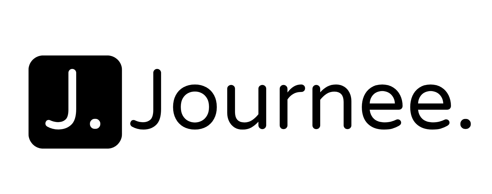

**Journee** is a thoughtfully redesigned **travel journaling application** that offers avid travellers a seamless yet powerful journaling experience. This application features a clean, minimalistic design, an interactive map to mark photo locations, and AI-powered technology to automatically generate location data.

## 📂 Project Links

-   **GitHub Repository:** [Journee on GitHub](https://github.com/saltydoge59/journee)
-   **Hosted Application:** The live application is hosted on Cloudflare Workers.

### 🔐 Login Instructions

For user authentication, Journee utilizes Apple/Google Authentication.

-   **Sign in:** Simply sign in using your Apple/Google account.
-   **Create a new account:** Alternatively, you can create a new account with a username and password.

## 🌟 Key Features

#### 1) **📔 Trip Journaling 📔**
-   Easily organise your trips and journal entries by date with a built-in, intuitive text editor. Color, decorate and add links to your text as you wish!
-   Relive your adventures by including photos in your journal.

#### 2) **🗺️ Snapspot 🗺️**
- Explore your travels through a dynamic map that connects your photos to their locations.
- Easily find specific moments with trip and day filters. 

## 📚 Technology Stack

Journee leverages modern web development frameworks and APIs to provide a seamless and dynamic user experience.

-   **Frontend:** Built with Next.js and styled with Tailwind CSS for responsive design, hosted on Cloudflare Workers.
-   **Database & Storage:** Cloudflare D1 (database) and Cloudflare R2 (image storage).
-   **Core Libraries:**
    -   **Aceternity** and **Shadcn** for smooth animations and additional UI elements.
    -   **Material UI** components for a polished and accessible user interface.
-   **Authentication:** Clerk is integrated to handle secure and streamlined user authentication.

### 🔗 Integrated APIs

Planty integrates several external APIs to provide enhanced functionality:

-   **Google Maps API:** [Google Maps API Documentation](https://developers.google.com/maps/documentation/places/web-service) for a dynamic map display.
-   **Gemini Developer API:** [Gemini API Documentation](https://ai.google.dev/) for advanced AI features used to generate location coordinates of uploaded photos.

## 🏷️ Versioning

This project follows [Semantic Versioning](https://semver.org/). See
[CHANGELOG.md](./CHANGELOG.md) for release history and
[CLAUDE.md](./CLAUDE.md) for the full versioning/changelog policy.

